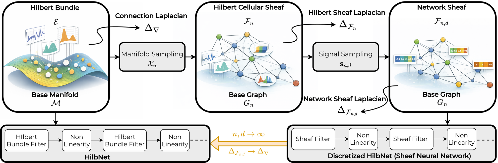

# Consistent Geometric Deep Learning via Hilbert Bundles and Cellular Sheaves

Kartik Tandon<sup>1,\*</sup>, Julian Gould<sup>2,\*</sup>, Tanishq Bhatia<sup>3</sup>, Francesca Dominici<sup>4</sup>, Alejandro Ribeiro<sup>1</sup>, Claudio Battiloro<sup>6,4,\*</sup>

<sup>1</sup>University of Pennsylvania, <sup>2</sup>Sakana AI, <sup>3</sup>Northeastern University, <sup>4</sup>Harvard University, <sup>5</sup>Brown University. <sup>\*</sup>Equal contribution.

[](https://arxiv.org/abs/2605.06395)

[](https://github.com/clabat9/hilbnet/actions/workflows/tests.yml)
[](LICENSE)



Each sensor in a traffic network records a time series, so the signal at a node of the road graph is a function of time. The same is true when nodes carry probability distributions or other infinite-dimensional objects. HilbNets are convolutional networks for this kind of data.

We model the data as a Hilbert bundle: a manifold with a Hilbert space of signals attached to each point, and a connection that transports signals between nearby points. A HilbNet stacks filters built from the connection Laplacian of the bundle, with pointwise nonlinearities in between.

In practice we only have samples. Sampling n points of the manifold turns the bundle into a Hilbert cellular sheaf on a graph. We prove that its sheaf Laplacian converges in probability to the connection Laplacian as n grows, which extends the result of Belkin and Niyogi (2008) for graph Laplacians to bundles of Hilbert spaces. Sampling each signal at d points then gives a network sheaf, and the discretized HilbNet on it is a sheaf neural network. As n and d grow, discretized HilbNets converge to the continuous HilbNet, and they transfer between different samplings of the same bundle.

This repository has the code for the experiments in the paper: transport recovery on a synthetic statistical bundle (Table 1), the spectral stability of the sheaf Laplacian (Figure 3), and traffic forecasting on METR-LA and PEMS-BAY (Table 2).

## Installation

We tested the code with Python 3.11 and PyTorch 2.2.2.

```bash
git clone https://github.com/clabat9/hilbnet.git
cd hilbnet
conda create -n hilbnet python=3.11 -y && conda activate hilbnet
pip install torch==2.2.2        # for a CUDA build, follow the instructions on pytorch.org
pip install -e ".[test]"
python -m pytest                # optional: run the tests
```

The other packages we tested with are numpy 1.26.4, scipy 1.17.1, pandas 3.0.2, h5py 3.16.0, matplotlib 3.10.8, torch-geometric 2.7.0 and PyYAML 6.0.3.

## Using HilbNet on your own graph

<!-- usage-snippet -->
```python
import torch
from hilbnet import HilbNetForecaster

# A 4-node cycle; every node carries a window of 12 time steps with 2 features.
edge_index = torch.tensor([[0, 1, 2, 3], [1, 2, 3, 0]])
model = HilbNetForecaster(
    n_nodes=4, time_steps_in=12, time_steps_out=12, edge_index=edge_index,
    in_features=[2, 16, 32], kappa=[2, 2], activation=torch.nn.ReLU(),
    transport_param_type="circulant", transport_init="identity_plus_noise",
)
x = torch.randn(8, 4, 12, 2)   # [batch, nodes, time steps, features]
y = model(x)                   # [8, 4, 12]: a 12-step forecast for every node
P = model.transport_maps       # [4, 12, 12]: one orthogonal transport map per edge
```

`kappa` is the number of terms of the polynomial filter in each layer; `kappa=[1, 1]` switches the sheaf Laplacian off and gives the MLP fiber baseline of Table 2. With `transport_param_type="direct"` the transport maps are free orthogonal matrices, built as products of `num_householder_reflections` Householder reflections. The transport maps are learned together with the filters.

## Reproducing the paper

The scripts write to `results/` and `figures/`, which git ignores, and print a summary table at the end. The numbers behind the paper are in `results/paper/`, which no script writes to. Unless stated otherwise, ± is the sample standard deviation over seeds.

### Table 1: transport recovery

The nodes are random covariance matrices of 4-dimensional Gaussians, joined by an 8-nearest-neighbor graph in the Wasserstein distance. Every edge carries the Levi-Civita transport of the Wasserstein metric, obtained from the parallel-transport equation, and we fit it with each of the three transport classes used in HilbNets. "Det." is the lowest fitting error reached during training and "Theory" is the distance from the target to the class, computed analytically.

```bash
python scripts/bundle_transport_recovery.py --config scripts/configs/synthetic/transport_recovery_paper.yaml
```

The output is `results/synthetic/transport_recovery_paper.json`, with one row per class, number of nodes n and seed. In it, the "Det." column of the paper is the field `empirical_frob` and "Theory" is `theory`. Our values (3 seeds) are:

| n | free O(d), Det. | circulant, Det. | circulant, Theory | frozen identity, Det. = Theory |
|---|---|---|---|---|
| 16 | (1.71 ± 0.17)·10⁻⁷ | (1.84 ± 0.29)·10⁻² | 1.84·10⁻² | (2.30 ± 0.31)·10⁻² |
| 32 | (1.28 ± 0.57)·10⁻⁷ | (1.18 ± 0.14)·10⁻² | 1.18·10⁻² | (1.46 ± 0.18)·10⁻² |
| 64 | (1.82 ± 0.47)·10⁻⁷ | (1.03 ± 0.14)·10⁻² | 1.03·10⁻² | (1.29 ± 0.16)·10⁻² |
| 128 | (2.22 ± 0.25)·10⁻⁷ | (8.94 ± 0.71)·10⁻³ | 8.93·10⁻³ | (1.11 ± 0.09)·10⁻² |
| 256 | (1.87 ± 0.35)·10⁻⁷ | (7.80 ± 0.12)·10⁻³ | 7.80·10⁻³ | (9.67 ± 0.18)·10⁻³ |

The free class contains the target, so its Theory value is 0 and training reaches float32 precision. The two restricted classes stop at their analytical floor.

### Figure 3: spectral stability

There is no training here. For fiber dimensions d = 3, 6 and 10 and sample sizes n = 50, ..., 800, we build the sheaf Laplacian from the Levi-Civita transports and compare its 32 smallest eigenvalues with those of a reference operator built from many more samples (n_max = 4000, 2000 and 1000).

```bash
python scripts/bundle_operator_convergence.py --config scripts/configs/synthetic/operator_convergence_paper.yaml
python scripts/bundle_make_figures.py --operator results/synthetic/operator_convergence_paper.json
```

The second command saves `figures/operator_convergence.pdf`. Pass `--operator results/paper/operator_convergence.json` to draw the figure from our run.

### Table 2: traffic forecasting

The METR-LA (207 sensors in Los Angeles) and PEMS-BAY (325 sensors in the San Francisco Bay Area) files we use were prepared by Li et al. (2018) for [DCRNN](https://github.com/liyaguang/DCRNN); please cite their paper if you use them.

1. Download `metr-la.h5` and `pems-bay.h5` from the [Google Drive folder](https://drive.google.com/open?id=10FOTa6HXPqX8Pf5WRoRwcFnW9BrNZEIX) linked in the "Data Preparation" section of the DCRNN repository.
2. Put them here:

   ```text
   data/traffic/metr-la/metr-la.h5
   data/traffic/pems-bay/pems-bay.h5
   ```

3. Check them (optional):

   ```text
   64784b76d6fb8ec9bff4b6decafb354da2bb37840468fdccee5044e511277c05  metr-la.h5
   65d69fb0a2323dba9867179eb7af47c8b814186bc459ff0a4937d21614153c8f  pems-bay.h5
   ```

The first run downloads the road-distance files from the DCRNN repository, so it needs network access, and reads the sensor IDs from the `.h5` files. We use the 70/10/20 chronological split, 12 input steps and the thresholded Gaussian-kernel graph of DCRNN, made symmetric.

Then train and evaluate the models:

```bash
python scripts/traffic_table_runner.py --dataset metr-la
python scripts/traffic_table_runner.py --dataset pems-bay
```

Each command trains the five models of Table 2 with 5 seeds (25 runs) and saves progress after every run in `results/traffic/<dataset>_table.json`, so running the same command again resumes an interrupted run. At the end it prints MAE, RMSE and MAPE at 15, 30 and 60 minutes. Use `--archs` and `--seeds` to run a subset, `--device` to choose the device, and `--epochs 1` to check the setup quickly (those results go to a separate file).

| Row of Table 2 | `--archs` name |
|---|---|
| MLP fiber baseline | `mlp_fiber` |
| Spatiotemporal graph baseline | `stgnn_conv` |
| HilbNet, frozen identity (GCN) | `frozen_id` |
| HilbNet, circulant | `circulant` |
| HilbNet, free O(T) | `free` |

The configs are in `scripts/configs/traffic/`, and our runs are in `results/paper/metr-la.json` and `results/paper/pems-bay.json` (MAPE is stored there as a fraction). Our MAE in mph, over 5 seeds:

| METR-LA | Params | 15 min | 30 min | 60 min |
|---|---:|---|---|---|
| MLP fiber baseline | 5,212 | 3.131 ± 0.004 | 3.775 ± 0.005 | 4.690 ± 0.011 |
| Spatiotemporal graph baseline | 8,908 | 3.453 ± 0.080 | 4.160 ± 0.117 | 5.277 ± 0.093 |
| HilbNet, frozen identity | 5,756 | 3.092 ± 0.007 | 3.713 ± 0.010 | 4.608 ± 0.034 |
| HilbNet, circulant | 11,656 | 2.939 ± 0.021 | 3.409 ± 0.032 | 4.059 ± 0.049 |
| HilbNet, free O(T) | 119,036 | 2.923 ± 0.013 | 3.372 ± 0.023 | 3.938 ± 0.030 |

| PEMS-BAY | Params | 15 min | 30 min | 60 min |
|---|---:|---|---|---|
| MLP fiber baseline | 5,212 | 1.459 ± 0.003 | 1.942 ± 0.004 | 2.513 ± 0.004 |
| Spatiotemporal graph baseline | 8,908 | 1.400 ± 0.002 | 1.850 ± 0.002 | 2.388 ± 0.004 |
| HilbNet, frozen identity | 5,756 | 1.439 ± 0.003 | 1.901 ± 0.006 | 2.446 ± 0.007 |
| HilbNet, circulant | 15,366 | 1.413 ± 0.002 | 1.806 ± 0.003 | 2.211 ± 0.014 |
| HilbNet, free O(T) | 190,268 | 1.417 ± 0.002 | 1.793 ± 0.005 | 2.181 ± 0.003 |

RMSE and MAPE are in the paper and in the JSON files. Params counts learnable parameters only. Table 2 in the paper also quotes FC-LSTM and STAEformer from their papers; STAEformer, with about 4.7M parameters, is more accurate than the HilbNets at every horizon.

### What to expect when you rerun

- Table 1: the graphs and the Theory column are deterministic and match ours up to floating-point rounding. Det. for the two learned classes also depends on the random initialization and on the random vectors drawn during training. Our original runs seeded these with Python's `hash()`, which changes between processes; this release uses a fixed seed instead, so your values will be close to ours but not identical.
- Figure 3: our run in `results/paper/` was made with this release. Earlier code placed the transport of each edge in the opposite direction from the paper's construction; correcting it changed the plotted values by at most 0.6%, and the curves look the same.
- Training on GPUs, and on CPUs with several threads, is not bitwise reproducible from run to run, so expect small differences from our numbers.

## Where things are in the code

| In the paper | In the code |
|---|---|
| Sheaf Laplacian with one transport map per edge | `hilbnet/utils.py` |
| HilbNet layer (polynomial filter in the sheaf Laplacian) | `HilbertConvLayer` in `hilbnet/layers.py` |
| Transport classes: free O(T), circulant, frozen identity | `hilbnet/_transport_setup.py`, `hilbnet/circulant_transport.py` |
| HilbNet forecaster and spatiotemporal graph baseline | `hilbnet/forecasters.py` |
| Statistical bundle over Sym++(n) and its Levi-Civita transport | `hilbnet/statistical_bundle.py` |
| Transports, projections and sheaf Laplacian for the synthetic experiments | `hilbnet/bundle_validation.py` |
| METR-LA and PEMS-BAY loading and graph construction | `hilbnet/traffic_loader.py` |
| Experiments and their configs | `scripts/`, `scripts/configs/` |

## Tests

```bash
python -m pytest
```

Besides unit tests, the suite ties the code to the paper. It recomputes part of the Theory column of Table 1 and every parameter count of Table 2. It checks that the files in `results/paper/` reproduce Tables 1 and 2 and that the sheaf Laplacian matches the paper's construction. Tests that need the traffic data or a GPU/MPS device are skipped when those are missing.

## Citation

```bibtex
@inproceedings{tandon2026consistent,
  title         = {Consistent Geometric Deep Learning via Hilbert Bundles and Cellular Sheaves},
  author        = {Tandon, Kartik and Gould, Julian and Bhatia, Tanishq and Dominici, Francesca and Ribeiro, Alejandro and Battiloro, Claudio},
  booktitle     = {Advances in Neural Information Processing Systems},
  year          = {2026},
  eprint        = {2605.06395},
  archivePrefix = {arXiv}
}
```

## Contact

For questions and bug reports, please open an issue. The corresponding authors are Kartik Tandon and Claudio Battiloro.

## License

MIT, see [LICENSE](LICENSE).
